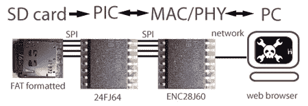
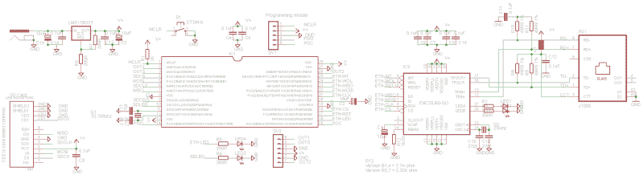

# 如何:名片上的 Web 服务器(第 2 部分)

> 原文:[https://hack aday . com/2008/09/25/we B- server-on-a-business-card-part-2/](https://hackaday.com/2008/09/25/web-server-on-a-business-card-part-2/)

这个迷你网络服务器比一张名片略小。有很多微型单板服务器，但这可能是你能在家里蚀刻和焊接的最小的。与许多嵌入式 web 服务器不同，文件存储在 PC 可读的 SD 卡上，而不是难以写入的 EEPROM 中。继续阅读关于 web 服务器设计的内容，或者了解上一篇文章中的 PIC 24F 基础知识:[名片上的 Web 服务器(第 1 部分)](http://hackaday.com/2008/09/18/web-server-on-a-business-card-part-1/)。

## 概念概述



这个项目的目标是在名片上建立一个 web 服务器，从 FAT 格式的 SD 卡上提供网页和文件。该服务器基于 PIC 24F，使用[](http://www.microchip.com/wwwproducts/Devices.aspx?dDocName=en022889)[以太网](http://en.wikipedia.org/wiki/MAC_Address)MAC/[PHY](http://en.wikipedia.org/wiki/Ethernet#Physical_layer)连接到 TCP/IP 网络。网络层和低级服务，如 [DNS](http://en.wikipedia.org/wiki/Domain_Name_System#Address_resolution_mechanism) 和 [DHCP](http://en.wikipedia.org/wiki/DHCP) ，由微芯片 TCP/IP 栈处理。一张 [FAT 12/16/32](http://en.wikipedia.org/wiki/File_Allocation_Table) 格式的 [SD 卡](http://en.wikipedia.org/wiki/Sd_card)包含网页和文件。一个非常简单的 [HTTP 服务器](http://en.wikipedia.org/wiki/Web_server)通过处理端口 80 上的页面请求，搜索 SD 卡中的请求，并为它们提供正确的[内容类型](http://en.wikipedia.org/wiki/Content_type#Content-Type)，从而将一切联系在一起。

## 五金器具

[T2】](https://hackaday.com/wp-content/uploads/2008/09/cct-large1.png)

### *微控制器(微芯片 PIC 24FJ64GA002)*

服务器的大脑是一个 16 位 [PIC 24FJ64GA002](http://www.microchip.com/wwwproducts/Devices.aspx?dDocName=en026374) (IC1)，一个 28 引脚的微控制器，有几个业余爱好者友好的封装。查看我们的 [PIC 24F 介绍](http://hackaday.com/2008/09/18/web-server-on-a-business-card-part-1/)，了解更多关于使用该芯片的信息。

PIC 24Fs 在 2 到 3.8 伏之间运行，这是完美的，因为以太网芯片(IC 2)和 SD 卡都在 3.3 伏下运行。该芯片有 8K 的 RAM，足够用于 TCP/IP 堆栈，还有几 K 用于完整的 FAT 文件系统。24FJ64 有两个 [SPI](http://en.wikipedia.org/wiki/Serial_Peripheral_Interface_Bus) 模块，因此 SD 卡和以太网 IC 各有一条专用数据总线。

PIC 处理器内核在 2.5v 电压下工作，需要一个 10uF 电容(C2)作为片内电压调节器。数据手册指定了钽电容，但我们在原型中使用了低 ESR 电解电容，没有发生任何事故。每个电源引脚都需要一个 0.1uF 的去耦电容(C4，5)。

内部 8MHz 振荡器提供 32MHz 时钟源，4 倍 PLL 乘法器使能。我们还使用外部 32.768KHz 晶振(Q1)和 2 个 27pF 电容(C17，18)来实现实时时钟日历。

编程连接被带到一个头部(SV1)。我们选择使用编程引脚对 3(pgx 3)。主机清零和复位(MCLR)功能通过从 V+到 MCLR 引脚的 2K 电阻(R1)使能。可选地，从 MCLR 到地增加[一个按钮](http://hackaday.com/2008/09/15/tact-switches-for-your-next-project/) (S1)用于手动复位开关。

### *以太网连接(ENC28J60)*

一个 [ENC28J60](http://www.microchip.com/wwwproducts/Devices.aspx?dDocName=en022889) (IC2)处理网络物理连接(PHY)和 MAC 层。除了典型的 0.1uF 去耦电容(C6、7、9、10)，ENC28J60 还需要许多支持器件。一个 25MHz 晶体(Q2)和 2 个 27pf 电容(C15，16)提供时钟信号。内部核心电压调节器需要一个 10uF 钽电容(C1)，但电解电容也能正常工作。带有 330 欧姆电阻(R2，3)的两个 led(led 1，2)显示链路和数据状态。

需要一个偏置电阻(R12 );该值将取决于您使用的 ENC28J60 版本。现在的芯片应该是 [B5](http://ww1.microchip.com/downloads/en/DeviceDoc/80264d.pdf) (PDF)或者 [B7](http://ww1.microchip.com/downloads/en/DeviceDoc/80349b.pdf) (PDF)，需要 2.32k±1%的电阻。

PHY I/O 部分指定了 4 个 49.9 欧姆 1%电阻(R8-11)和一个铁氧体磁珠(L1)。

最难找到的部分，ENC28J60 是正确的 RJ-45 插孔与集成磁性(RJ1)。我们使用 Pulse Engineering 的 J1006F21 PulseJack。如果您使用不同的插孔，请务必检查引脚配置和连接，它们可能与我们的不同。JP1006F21 的 Cadsoft Eagle 零件库包含在项目档案中。这是一个 4 美元的零件，但现在已经涨到 7 美元了。如果你知道其他插孔的工作，我们将在这里添加它们。

### *microSD 卡*

我们在这个设计中使用了一个 [microSD/transflash 卡](http://en.wikipedia.org/wiki/MicroSD)，因为 SD 卡浪费了支架下的大量电路板空间。microSD 卡是 SD 卡的较小版本，具有相同的数据接口，大多数都带有适配器，用于标准 SD 卡读卡器。该卡需要一个支架(SD1)和一个 0.1uF 去耦电容(C8)。

如果你想使用一个全尺寸的 SD 卡，看看我们在项目档案中的第一版原型。我们用的是 Alps SD 卡座 [#SCDA1A0901](http://www.mouser.com/Search/ProductDetail.aspx?R=SCDA1A0901virtualkey68800000virtualkey688-SCDA1A0901) 。不幸的是，这部分已经停产，我们还没有找到合适的替代品。不要尝试 [#SCDA5A0201](https://www.mouser.com/Search/ProductDetail.aspx?R=SCDA5A0201virtualkey68800000virtualkey688-SCDA5A0201) ，这是肯定的。如果你有喜欢的，我们会加在这里。 [Sparkfun 有一个](http://www.sparkfun.com/commerce/product_info.php?products_id=136)，和一个匹配的 [Cadsoft Eagle 零件库](http://www.opencircuits.com/SFE_Footprint_Library_Eagle)。

### *电源*

使用 390 欧姆(R6)和 240 欧姆(R7)电阻器将[可调 LM317 电压调节器](http://hackaday.com/2008/09/22/parts-lm317-adjustable-voltage-regulator/) (IC3)设置为 3.3 伏。我们考虑了几种 3.3 伏稳压器，但没有比 LM317 和两个电阻更便宜的了。两侧各有一个 0.1uF 去耦电容(C13，14)和一个 10uF 电容(C3，19)，有助于支持高功耗以太网收发器。LM317 将从 5 到 20 伏+的输入输出 3.3 伏，但当电源电压超过 9 伏时，它会变得非常热。指定的输入电容的额定电压仅为 16 伏，因此如果您计划使用高于 9 伏的电源，请考虑升级。

我们有史以来第一次将电源插孔(J1)整合到设计中。带有 2.1 毫米直径内部引脚的插孔似乎是最常见的 DC 连接器。我们使用了廉价的通孔 DC 电源插孔，如 SparkFun [#PRT-00119](http://www.sparkfun.com/commerce/product_info.php?products_id=119) 或 Mouser [#163-7620-E](http://www.mouser.com/Search/ProductDetail.aspx?qs=8xMK%252bwDsXhcfMNb%2fYnnwLQ%3d%3d) 。它与类似 Mouser [#1710-0721](http://www.mouser.com/Search/ProductDetail.aspx?R=1710-0721virtualkey11180000virtualkey1710-0721) 的插头相匹配。

## 电路板


PCB ( [全尺寸放置。png](http://hackaday.com/files/2008/09/pcb-full1.png) 是在 [Cadsoft Eagle 5.0](http://www.cadsoft.de/) 中设计的。免费软件版本适用于所有主要平台。渲染是用 [Eagle3D](http://www.matwei.de/doku.php?id=en:eagle3d:eagle3d) ， [beta 版](http://www.diylife.com/2008/06/06/cadsoft-eagle-5-test-drive/)完成的。原理图和电路板文件包含在[项目档案](http://www.whereisian.com/files/wsbcv3.zip) (ZIP)中。

我们用大型 SOIC 芯片和 0805 表面贴装(SMD)器件设计了该项目，但憎恨者可以放心，芯片采用通孔封装。我们更喜欢使用 SMD 器件，因为由此产生的电路板更小、更便宜、生产速度更快。0805 零件非常便宜，很容易用普通烙铁焊接。不要指望这个项目在试验板上工作，这个电路可能有太多的电容。

我们充分利用 PIC 的可编程引脚布局，尽可能获得最简单的走线路径。在单面板上只需要四根跳线。

痕迹又大又干净，DIY [墨粉转移板](http://www.hackaday.com/2008/07/28/how-to-etch-a-single-sided-pcb/)应该很容易。我们使用喷墨打印机透明掩模在紫外敏感电路板上制作 PCB。

除了最终设计，项目档案还包含我们的 v1 原型设计。原型使用全尺寸 SD 卡( [SCDA1A0901](http://www.mouser.com/Search/ProductDetail.aspx?R=SCDA1A0901virtualkey68800000virtualkey688-SCDA1A0901) )和所有 10uF 电解电容。我们还将 RJ45 以太网插孔放在子板上，以更好地适应不同的引脚排列。

### *缔约方清单*


| # | 数数 | 部分 | 大小 | 鼠标# |
| IC1 | one | [PIC 24FJ64GA002-SO](http://www.microchip.com/wwwproducts/Devices.aspx?dDocName=en026374) | SOIC-28 战斗机 | [579-PIC24FJ64GA002SO](http://www.mouser.com/Search/ProductDetail.aspx?qs=V%2fyyTCAHA4D%2fh5r3CRQDtA%3d%3d) |
| IC2 | one | ENC28J60 | SOIC-28 战斗机 | [579-ENC28J60-我/所以](http://www.mouser.com/Search/ProductDetail.aspx?qs=8nGS%2fuaWW3uX0KPZZN505g%3d%3d) |
| IC3 | one | LM317 电压调节器 | D2Pack | 511-LM317D2T-TR |
| C1-3 | three | 10uF 钽电容 | 一个案子 | [74-293D106X96R3A2TE3](http://www.mouser.com/Search/ProductDetail.aspx?R=293D106X96R3A2TE3virtualkey61320000virtualkey74-293D106X96R3A2TE3) |
| C4-14 | Eleven | 0.1uF 电容 | 0805 | [80-C0805C104M5R](https://www.mouser.com/Search/ProductDetail.aspx?R=C0805C104M5RACTUvirtualkey64600000virtualkey80-C0805C104M5R) |
| C15-18 | four | 27pF 电容 | 0805 | 140-CC501N270J-RC |
| C19 | one | 10uF 电容 | 0805 | [647-UWF1C100MCL1GB](https://www.mouser.com/Search/ProductDetail.aspx?R=UWF1C100MCL1GBvirtualkey64700000virtualkey647-UWF1C100MCL1GB) |
| R1 | one | 2k 0 欧姆电阻器 | 0805 | 292-2.0K-RC |
| R2-6 | five | 390 欧姆电阻器 | 0805 | 71-CRCW0805-390 |
| R7 | one | 240 欧姆电阻器 | 0805 | 71-CRCW0805-240 |
| R8-11 | four | 49.9 欧姆 1%电阻 | 0805 | E3 |
| R12 | one | 2K32ohm 1%电阻 | 0805 | 71-CRCW0805-2.32K-E3 |
| 腰神经 2 | one | 铁氧体磁珠 | 0805 | [81-BLM21BB600SN1D](https://www.mouser.com/Search/ProductDetail.aspx?R=BLM21BB600SN1Dvirtualkey64800000virtualkey81-BLM21BB600SN1D) |
| LED1-4 | four | 发光二极管 | 0805 | 645-598-8110-107F |
| 雌三醇环戊醚 | one | 32.768 千赫晶体 | DoctorofSacredMusic 圣乐博士 | 695-CM200S-327KF-U |
| Q2 | one | 25 兆赫晶体 | HC49 | 815-ABLS-25-B2 |
| RJ1 | one | 脉冲 J1006F21 | – | [673-J1006F21](https://www.mouser.com/Search/ProductDetail.aspx?R=J1006F21virtualkey67300000virtualkey673-J1006F21) |
| S1 | one | 触觉开关 | DTS-6 | 101-0164-EV |
| SV1，2 | Eleven | . 1”公插头 | – | [571-41033290](http://www.mouser.com/Search/ProductDetail.aspx?R=4-103329-0virtualkey57100000virtualkey571-41033290) |
| J1 | one | 电源插座 | – | 163-7620-E |
| SD1 | one | microSD 卡座 | – | SparkFun: [PRT-00127](http://www.sparkfun.com/commerce/product_info.php?products_id=127) |

## 固件

三个固件示例包含在[项目档案](http://www.whereisian.com/files/wsbcv3.zip)【zip】中。这些示例使用 Microchip 的演示 C30 编译器进行编译。在我们的前一篇文章中了解更多关于使用 PIC 24F 的信息:[名片上的 Web 服务器(第一部分)](http://hackaday.com/2008/09/18/web-server-on-a-business-card-part-1/)。MPLAB 在项目可移植性方面不太好，如果您的路径与我们使用的“c:wsbc”格式不匹配，您可能需要重新定位所有的项目文件。

### *FAT12/16/32 磁盘库*

我们的第一步是从 SD 卡中读取 FAT 库。FAT 12/16/32 是简单的磁盘存储格式，适用于 PC、MAC、数码相机、音乐播放器和其他电子设备。下面是我们最喜欢的[胖教程/拆机](http://www.digitalspirit.org/file/index.php/obj-download/docs/fat/appnote_fat16.pdf) (PDF)。

微芯片的 FAT 12/16/32 库为我们提供了使用 SD 卡的简单功能。包含的演示应用程序创建了一些文件和目录来演示每个功能。下面是我们如何将其配置为在我们的定制硬件上工作，您可以通过搜索代码中的标签“HACKADAY”来找到这些更改:

*   HardwareProfile.h 将实际的 PIC 硬件分配给代码库中的通用引用。对于 SD 卡，这是一个 SPI 接口，以及用于片选和卡检测的引脚。首先，我们删除了所有未使用的硬件配置文件，使代码更易于管理。接下来，我们将 FAT 库配置为使用 SPI 模块与 SD 卡通信(第 132 行)。最后，我们定义了 SPI 引脚分配(第 152 行)。引脚设置如下表所示。

    | 引脚 | **端口** |
    | 芯片选择 | B0 |
    | SD 卡检测 | 主动脉第二声 |
    | SPI 时钟 |  |
    | SPI MOSI | B1 |
    | SPI 味噌 | B3 |

*   在第 48 行，我们设置了一个自定义振荡器熔丝配置，如我们的 [PIC 24F 简介](http://hackaday.com/2008/09/18/web-server-on-a-business-card-part-1/)中所述。这也是用外设引脚选择(第 63 行)配置引脚分配的逻辑位置。
*   该文件启用文件系统库的各种组件，影响所使用的内存和程序空间量。只读库很小，完全写配置更大。我们不必为演示做任何更改，但这是一个需要注意的重要文件。

起初，图书馆无法识别我们的 SD 卡。它只支持带有[主引导记录](http://en.wikipedia.org/wiki/Master_boot_record) (MBR)的磁盘。Windows XP 将 SD 卡格式化为 DOS 磁盘:没有 MBR 的单一分区。为了验证这一点，使用类似 [HxD](http://mh-nexus.de/en/hxd/) 的实用程序打开一个 Windows 格式的磁盘，并检查物理磁盘的扇区 0。字节 446 应该是第一个 MBR 分区条目的位置，但是它是 NTLDR 可执行代码。

要将磁盘格式化为“正确的”FAT 格式，请使用数码相机的格式化功能或类似于[松下 SD 卡格式化程序](http://panasonic.jp/support/global/cs/sd/download/sd_formatter.html)的实用程序。我们也考虑过使用不同的 FAT 库来读取 DOS 磁盘，比如 [DOSFS](http://www.larwe.com/zws/products/dosfs/index.html) ，或者给微芯片固件添加类似的功能。

### *TCP/IP 协议栈*

微芯片的免费 TCP/IP 栈执行运行网络服务器所需的复杂配置和网络功能。您可以在各种[应用笔记和文档](http://www.microchip.com/stellent/idcplg?IdcService=SS_GET_PAGE&nodeId=2505&param=en535724)中了解关于该堆栈的所有信息。维基百科是我们最喜欢的 [TCP/IP 学习资源](http://en.wikipedia.org/wiki/TCPIP)；我们只用维基百科编写了第一个 TCP/IP 协议栈。

Microchip 的 TCP/IP 堆栈曾经混乱不堪。现在只是很困惑。的最近几个版本在代码清晰度和结构方面有了相当大的改进。以下是我们为硬件配置基本 TCP/IP 堆栈的示例，您可以通过搜索代码中的标记“HACKADAY”来找到这些更改:

*   HardwareProfile.h 将实际的 PIC 硬件资源分配给代码库中的通用引用。我们添加了自定义振荡器配置(第 68 行)，并将服务器状态 LED 配置为使用连接到端口 B7 的 LED(第 83 行)。我们将 ENC28J60 的 SPI 接口定义如下(第 116 行):
    T38】SPI 味噌

    | **引脚** | **端口** |
    | 重置 |  |
    | 芯片选择 | B9 |
    | SPI 时钟 | B10 |
    | SPI MOSI | B11 |
    | B12 |
    | 局域网唤醒 | B13 |
    | 中断 | B14 |

*   MainDemo.c .我们剔除了一堆不用的代码，在 *InitializeBoard()* 函数中加入了外设引脚选择配置代码(第 332 行)。
*   TCPIPConfig.h 定义编译中包含的 TCPIP 堆栈组件。我们已经启用了 DNS、DHCP、IP 公告器和 ping 服务器(第 56 行):

```

#define STACK_USE_DNS            // Domain Name Service Client
#define STACK_USE_DHCP_CLIENT    // Get DNS automagically
#define STACK_USE_ANNOUNCE       // Microchip Ethernet Device Discoverer
#define STACK_USE_ICMP_SERVER    // Enable the PING server
```

加载固件后，我们就可以第一次将服务器连接到网络了。在初始化期间，TCP/IP 堆栈使用 DHCP 与网络路由器协商 IP 地址。我们需要知道这个地址才能与设备通信。如果设备有一个屏幕，我们可以显示 IP 地址，但我们使用微芯片的 MCHPDetect.exe 实用程序。


当 TCP/IP 堆栈完成初始化时，它会向所有本地连接的计算机的端口 30303 广播一个通告数据包。MCHPDetect 从这些数据包中提取 IP 地址。每次 PIC 复位时都会发送一个新的通告数据包。


也可以用调试器直接从内存中读取 IP 地址。该地址存储在 *AppConfig 中。MyIPAddr* 变量，*。字节*格式遵循标准的 x.x.x.x IP 符号。


一旦我们有了 IP 地址，我们就可以 ping 服务器并测试它的响应能力。


如果 ping 显示高延迟或格式错误的数据包，您可以使用 [Wireshark](http://www.wireshark.org/) 在字节级别检查网络流量。除非你在德国，因为[可能是犯罪](http://www.theregister.co.uk/2007/08/13/german_anti-hacker_law/)。

*构建定制 HTTP 服务器*

自定义 web 服务器在 SD 卡上查找请求的文件，并以正确的内容类型发送它们。我们使用 Microchip HTTP 示例服务器 v1 (HTTP.c)作为我们的 FAT 文件服务器(FATHTTP.c)的基础。

Microchip 的 HTTP 服务器使用一种简单的文件系统，叫做 MPFS，来索引 EEPROM 芯片上的网页。我们将对 MPFS 函数的调用替换为对 FAT 库中函数的调用(参见 FATHTTP.c 中的 *HTTPProcess* 和 *Sendfile* 函数)。我们的更改尽可能简单地演示了这个概念，没有添加令人困惑的指针和其他方便的 C 混淆。代码留下了大量的改进空间，开始吧。文件写入在默认编译中是禁用的，但是如果您想要写入 SD 卡，有足够的程序空间来启用它们(参见 FSConfig.h)。

有必要向 TCP/IP 堆栈的其余部分注册我们的自定义 FATHTTP 服务器。我们搜索并替换了原来的 HTTP 服务器组件，并根据需要添加了对新 FATHTTP 服务器的调用。原来是这些地方:

*   首先，我们插入了一些启用 FATHTTP 服务器的定义(第 70 行)，并为 FATHTTP 服务器添加了一个 TCP 套接字(第 248 行)。
*   接下来，我们将 FATHTTP 添加到需要 TCP/IP 堆栈的服务列表中(第 170 行)，然后包括必要的头(第 351 行)。
*   我们将 FATHTTP 服务器初始化(第 138 行)和处理(第 340 行)功能添加到 TCP/IP 堆栈任务列表中。
*   我们还需要包含一些处理 URL 的助手函数(第 259 行)。

终于，是时候把一些文件放在 SD 卡上并测试这个东西了。确保您的文件遵循 [8.3 文件名格式](http://en.wikipedia.org/wiki/8.3_filename)。项目档案包含一个带有测试图像和 zip 文件的示例网站。


用 MCHPDetect 抓取了服务器的 IP 地址后，我们用一个浏览器对着它。单独输入的 IP 地址会将浏览器重定向到*index.htm*，不管它是否存在。存储在 SD 卡上的网页和图像显示在浏览器中，但未知的二进制类型会触发下载提示。

## 更进一步


我们看到许多潜在的项目使用这个微小的网络平台。

*   在 FATHTTP.c 源代码中为触发事件或配置 pin 的特殊 URL 添加挂钩。
*   建立一个可远程访问的数据记录器。使用额外的引脚读取传感器并将数据记录到 SD 卡。日志可从网络浏览器或直接从 FAT 可读 SD 卡中检索。
*   远程访问一个古老的串行终端或 BBS，可选地记录控制台输出。使用两个外部引脚作为串行端口，并使用 Microchip 的 Telnet 服务器和以太网到串行桥示例从互联网转发命令。
*   你的建议？

下一次，我们将使用迷你服务器来制作一个连接互联网的电子室内涂鸦墙。这将是一个互动项目，每个人都可以贡献在线涂鸦和动画。

原理图、电路板和固件文件包含在[项目档案](http://blog.mahalo.com/hackaday/howto/wsbcv3.zip) (ZIP)中。使用免费版本的 [Cadsoft Eagle](http://www.cadsoft.de) 查看原理图和 PCB。固件用 C 语言编写，用[微芯片演示 C30 编译器](http://www.microchip.com/stellent/idcplg?IdcService=SS_GET_PAGE&nodeId=1406&dDocName=en010065)编译。

