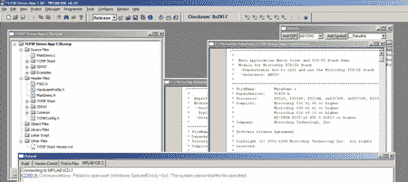

# How-To:名片上的 Web 服务器(第 1 部分)

> 原文:[https://hack aday . com/2008/09/18/we B- server-on-a-business-card-part-1/](https://hackaday.com/2008/09/18/web-server-on-a-business-card-part-1/)


多年来，微芯片 PIC 微控制器占主导地位； [PIC16F84](//www.microchip.com/wwwproducts/Devices.aspx?dDocName=en010230) 到处都是[的黑客和项目](http://www.google.com/search?q=16f84+projects)。 [8 位 16F 和 18F](http://www.microchip.com/stellent/idcplg?IdcService=SS_GET_PAGE&nodeId=74) 线由几种编码环境和[易于构建的串口编程器](http://www.instructables.com/id/Business-Card-PIC-Programmer/)支持。微芯片的 16 位 [PIC24F](http://www.microchip.com/stellent/idcplg?IdcService=SS_GET_PAGE&nodeId=75) 更便宜、更快、更容易操作，但在黑客和项目中基本没有。

我们最近在一个迷你 web 服务器项目中使用了一个[微芯片](http://www.microchip.com) PIC24F 微控制器，但是没有找到很多介绍性的参考资料可以链接。在本文中，我们将涵盖一些 PIC 24F 的基础知识:支持电路和编程选项。我们还将讨论我们最喜欢的特性，以及我们是如何发现它们的。我们的下一篇文章将概述基于 PIC 24F 的名片上的 web 服务器。

**基本电路**


这是基本支持电路([全尺寸)。png](http://hackaday.com/wp-content/uploads/2008/09/base-cct-large.jpg) 换一张 PIC [24FJ64GA002](http://www.microchip.com/wwwproducts/Devices.aspx?dDocName=en026374) 。一些有用的文档包括[代码示例](http://www.microchip.com/stellent/idcplg?IdcService=SS_GET_PAGE&nodeId=2656)、[应用笔记](http://www.microchip.com/stellent/idcplg?IdcService=SS_GET_PAGE&nodeId=1469)、[个人数据表](http://www.microchip.com/ParamChartSearch/chart.aspx?branchID=8181&mid=14&lang=en&pageId=75)和 [24F 系列手册](http://www.microchip.com/stellent/idcplg?IdcService=SS_GET_PAGE&nodeId=2575)。

*主系统电源*

24F PICs 上的外围设备和引脚在 2.0 至 3.8 伏之间工作。这是与旧 PICs 相比的一大优势，因为 24F 可以直接连接现代 3.3 伏组件，如 [SD 存储卡](http://en.wikipedia.org/wiki/Secure_Digital_card)。一些 16F 和 18F 的图片将在 3.3 伏下运行，但通常速度会大大降低。与往常一样，在每个电源引脚和地之间放置一个 0.1uF 电容，以将芯片从电源去耦(C2 C1)。

*核心电源*

处理器内核需要单独的 2.5 伏电源。将 DISVREG 引脚接地，并在 Vcap/VDDCORE 引脚和地(C3)之间放置一个 10uF 电容，可以使能内置 2.5v 稳压器。使用 10uF 低 ESR 电解电容时，我们没有遇到任何问题，但未来我们将使用数据手册中指定的钽电容。

*速度和晶体*

PIC 24Fs 的最大时钟速度为 32MHz，每 2 个时钟周期完成一次操作，最高速度为每秒 1600 万条指令(MIPS)。大多数 24Fs 内置 8MHz 振荡器，但您也可以使用外部晶振来获得更精确的时基。内部锁相环(PLL)可以将任何时钟信号放大 4 倍。

我们使用一个常见的选项:8MHz 内部振荡器乘以 4(32 MHz)，外部振荡器引脚具有完整的 IO 功能。时钟模式通过 CONFIG2 设置。使用这些设置，使用内部振荡器和 PLL 以 32MHz 运行 PIC 24F:

```

// Internal FRC OSC with 4x PLL @ 32MHz
//from p24FJ64GA002.h:
//FNOSC_FRCPLL - internal oscillator
//OSCIOFNC_ON  - enable the oscillator pins as IO
//POSCMOD_NONE - Primary (external) oscillator disabled

_CONFIG2(FNOSC_FRCPLL &amp; OSCIOFNC_ON &amp;POSCMOD_NONE)

```

*编程连接*

微芯片的标准 5 线[电路串行编程](http://www.instructables.com/id/Understanding-ICSP-for-PIC-Microcontrollers/) (ICSP)连接用于编程 24F。ICSP 由时钟线(PGC)、双向数据线(PGD)、主清除和复位(MCLR)以及电源(V+)和地(GND)连接组成。


当电压过低而无法运行时，MCLR 功能会重置芯片。在系统电源和 MCLR 引脚之间连接一个 2000 (2K)欧姆的电阻(R12)使能它。或者，为手动复位开关添加一个从 MCLR 到地的按钮(S1)。编程器还连接到 MCLR 引脚，以重置 PIC 和控制编程模式。

PIC 24Fs 有几组标记为 PGDx 和 PGCx 的编程引脚。选择最适合您设计的套件。有一个问题:你不能使用一组的时钟引脚和另一组的数据引脚，你必须使用同一对。

用于调试的主要引脚对通过 ICS_PGX 选项在 CONFIG1 中进行编程。这只会影响调试；仍然可以从任何引脚对进行编程。

```
_CONFIG1( ICS_PGx3)
```

**编码和编程**

不幸的是，24F 不能用业余爱好者最喜欢的串行端口程序员编程。这些通常是 5 伏编程器，在 MCLR 引脚上施加 13 伏电压。24F PICs 在 MCLR 和编程引脚上的最大额定电压为 3.8 伏，老的串口程序员会破坏它们。

ICD2 是微芯片最便宜的 24F 系列编程器。如果你有一个 edu 的电子邮件地址，就可以享受教育折扣。也有许多克隆体，最著名的是 [Olimex](http://www.olimex.com/dev/index.html) PIC-ICD2 克隆体，也是由 Sparkfun 出售的[。我们从未用过它，但它应该是一个精确的克隆。你也可以试着自己动手制作一个](http://www.sparkfun.com/commerce/product_info.php?products_id=5) [DIY ICD2 克隆体](http://www.icd2clone.com/wiki/Main_Page)，我们过去在 PiCS Rev B 上运气不错。你可能需要建立一个适配器来[使用带有 PIC 24F](http://www.edaboard.com/ftopic176893.html) 的自制 ICD2。



MPLAB 是一个免费的开发环境，用于编码、编译和调试所有 PIC 微控制器。我们喜欢用 C 语言编程，所以我们下载了集成到 MPLAB 中的[微芯片 C30 编译器](http://www.microchip.com/stellent/idcplg?IdcService=SS_GET_PAGE&nodeId=1406&dDocName=en010065)的免费评估/学生版。[如果你对 MPLAB 不感兴趣，高科的 C 编译器](http://microchip.htsoft.com/)是一个相当受欢迎的选择。

微芯片的低压 18FxxJ 线，比如以太网使能的 [18F97J60](http://www.microchip.com/ParamChartSearch/chart.aspx?branchID=121&mid=10&lang=en&pageId=74) ，只能编程几百次。这对生产来说没问题，但对开发人员来说真的不友好。我们非常高兴地注意到，24F 可以编程至少 10，000 次。

**新功能和改进**

在一个项目中使用 PIC 24F 后，我们列出了我们最喜欢它的地方。并不是所有的设计都是新的，有时小小的改进会让设计变得更简单。

*8 位 vs 16 位*

c 程序员不会注意到 [8 位](http://en.wikipedia.org/wiki/8-bit)和 [16 位](http://en.wikipedia.org/wiki/16-bit)架构之间的许多差异。如果您使用 16 位整数数学，本机 16 位数学运算将为您节省几个周期。内存和寄存器是 16 位长，这意味着默认的 16 位变量类型计数为 65，536，而不是 255。

*外设引脚选择*

外设引脚选择(PPS)是 PIC 24F 上我们最喜欢的功能。数字外设 SPI、UARTs、定时器等几乎可以连接到芯片上的任何引脚。


PCB 设计变得非常有创意，因为微控制器上的引脚排列很少与你所连接的外设相匹配。比较一下这两种设计。左边的设计使用循环、缠绕走线来连接 SD 卡，无需跳线。在右边，我们使用 PPS 以一种与 SD 卡完美匹配的方式分配 pin。我们在左边的棋盘上花了咖啡因提神的夜晚，但在另一边只花了几个小时。我们会发现很难再用 PIC 16F 或 18F 工作，因为 PPS 完全和完全令人惊叹。

输入和输出引脚分配不同:引脚分配给输入，输出分配给引脚。外设输入，如 [SPI 接口](http://en.wikipedia.org/wiki/Serial_Peripheral_Interface_Bus)的“串行数据输入”(SDI)信号，通过在其寄存器中放置一个引脚编号来设置。在 C30 编译器中，SPI1 和 SPI2 的 SDI 分配如下:

```

// Inputs
//SDI1 B12/23/RP12
//SDI2 B1/5/RP1

RPINR20bits.SDI1R = 12;            //SDI1 = PORTB12

RPINR22bits.SDI2R = 1;            //SDI2 = PORTB1
```

输出函数以相反的方式处理。一组寄存器代表可编程引脚(RPORx)。外设输出分配给每个引脚。像这样分配 SPI“串行数据输出”和“时钟输出”线:

```

// Outputs
//SDO1 B11/22/RP11   //CLK1 B10/21/RD10

RPOR5bits.RP10R = SCK1OUT_IO;     //RP10 = SCK1

RPOR5bits.RP11R = SDO1_IO;        //RP11 = SDO1

//SDO2 B3/7/RP3       //CLK2 B2/6/RP2

RPOR1bits.RP2R = SCK2OUT_IO;     //RP2 = SCK2

RPOR1bits.RP3R = SDO2_IO;        //RP3 = SDO2
```

查看器件数据手册和带 PPS 数据手册 (PDF)的 [IO，了解外设(RPINRxx)和引脚(RPORx)寄存器的完整列表。](http://ww1.microchip.com/downloads/en/DeviceDoc/39711b.pdf)

*可单独配置的上拉/下拉电阻*

[当没有其他信号时，上拉和下拉电阻](http://en.wikipedia.org/wiki/Pull-up_resistor)将输入保持在已知水平。如下图左侧(S1)所示，上拉电阻(R1)通常将信号保持在高电平(1)。按下按钮将信号拉至地(0)。如果没有上拉电阻，微控制器引脚上的值将大幅波动(状态未定义)，直到按下按钮将其拉至地(0)。


内部上拉电阻使电路板上的按钮布线更加容易。内部电阻将信号保持在高电平，直到按钮将其拉低，从而节省了电阻和电源走线(S2)。PIC 16Fs 和 18Fs 有时在 8 个引脚上具有全有或全无上拉电阻，但 24F 增加了可单独配置的上拉电阻。参见 [IO 数据表](http://ww1.microchip.com/downloads/en/DeviceDoc/39711b.pdf) (PDF)。

*CRC 硬件模块*

[循环冗余校验](http://en.wikipedia.org/wiki/Cyclic_redundancy_check) (CRC)值用于验证数据的完整性。您的电脑计算了通过网络传送此页面的 TCP 数据包的 CRC。24F 有一个硬件 CRC 模块，可以在没有处理器参与的情况下进行繁琐的 CRC 计算。查看[数据表](http://ww1.microchip.com/downloads/en/DeviceDoc/39714a.pdf) (PDF)和[示例代码](http://ww1.microchip.com/downloads/en/DeviceDoc/CE312%20CRC.zip) (ZIP)。

*实时时钟和日历*

微芯片在每个 24F 上增加了一个硬件[实时时钟和日历](http://en.wikipedia.org/wiki/Real-time_clock)模块(RTCC)。给微控制器添加一个基于中断的时钟总是很容易的，但是这个模块可以处理所有的事情，而不需要考虑时序。


RTCC 模块需要一个 32.768khz 的手表晶振(Q1)连接到 SOSCx 引脚对。不要忘记 2 个适合你的晶体电容，我们使用 27pF (C1，C2)。RTCC 模块 (PDF)有[数据表，](http://ww1.microchip.com/downloads/en/DeviceDoc/39696b.pdf)[示例代码](http://ww1.microchip.com/downloads/en/DeviceDoc/RTCC.zip) (ZIP)。

**包装尺寸**


微芯片延续了他们提供各种包装尺寸产品的传统。低引脚数器件提供[通孔(DIP)](http://en.wikipedia.org/wiki/Dual_in-line_package) 和多种表面贴装尺寸。不过，和所有制造商一样，最大、最冷的芯片只采用表面贴装封装。Microchip 是一个由 64、80 和 100 针的方形扁平封装(TQFP)组成的风扇，这是一个正方形芯片，每边都有相同数量的针。TQFP 并不是很难焊接，但在家制作电路板可能会很痛苦。

**结论**

过去主要是基于 8 位 PIC 16F 和 18F 的微控制器项目。然而，16 位图片在很大程度上被忽视了。如果你已经在考虑为你的下一个项目拍摄一张照片，看看 24F 系列。外设引脚选择特性本身就值得一换，它简化了电路板，减少了布线时间，节省了电路板空间。我们能够使用自制的 PCB 将整个 PIC 24F 网络服务器安装在一张名片上。我们的下一篇文章将介绍这个简单的服务器原型。

[项目档案](http://blog.mahalo.com/hackaday/howto/PIC24FIntro.zip) (ZIP)包含 PIC24FJ64GA002 的基本原理图，以及我们添加到现有 [PIC 24F 零件库](http://www.cadsoft.de/cgi-bin/download.pl?page=/home/cadsoft/html_public/download.htm.en&dir=pub/userfiles/doc)的自定义 28 引脚零件。两者都与 [Cadsoft Eagle](http://www.cadsoft.de/info.htm) 一起使用，一个[免费版本可用于大多数流行平台](http://www.cadsoft.de/download.htm)。

