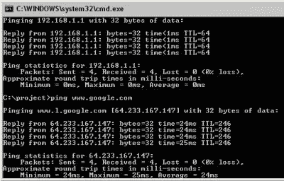
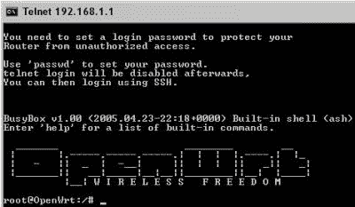
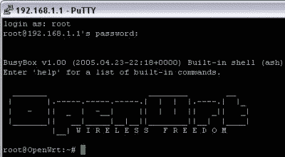
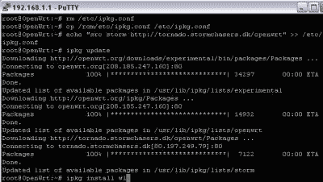
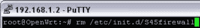
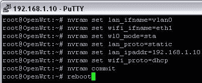
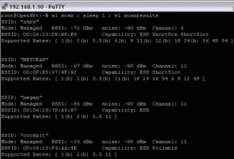

# 如何:WRT 客户端模式

> 原文：<https://hackaday.com/2005/05/13/how-to-wrt-client-mode/>

Linksys WRT54G 可能是世界上最便宜、销量最大的嵌入式 Linux 设备。玩起来也非常有趣。很多人不想完全投入到 Linux 中，因为害怕搞坏他们的电脑。为什么不修理你的路由器？！你的 S.O .可能甚至不会注意到，直到你打破它？所以如果可以的话，试着归咎于有线电视公司。

我将带您在 Linksys WRT54G 上安装 openWRT 固件。然后在客户端模式下设置路由器。客户端模式允许您将路由器有线端的计算机无线连接到另一台路由器，它甚至不一定是您的！请继续阅读，了解这个过程有多简单。

我用的是 Linksys WRT54G 版本。2.0 的“实验性”版本。首先:在尝试之前，确保你已经阅读并理解了 [openwrt wiki](http://openwrt.org/OpenWrtDocs) 上的所有内容。
在嵌入式设备上安装定制固件总是很棘手，但如果你贸然尝试，你肯定会
以砖头告终。我在 XP 中做这个，但是你可以使用任何你想要的。

从
[官方服务器](http://openwrt.org/downloads/experimental/bin/)获取实验二进制固件版本。使用与您的路由器
匹配的设备，并选择 squashfs，因为它是一个故障保护设备。维基似乎在推动稳定的构建，但是
这些都被否决了。

“boot_wait”标志需要设置为“on ”,以允许固件刷新(以及在出现问题时重新刷新)。Boot_wait 延迟路由器启动过程，以便在紧急情况下，您可以在这段时间
内刷新新固件。设置此标志需要在路由器内置的 ping.asp 页面中键入命令。如何
做到这一点的细节在维基中。我已经在安装 Sveasoft 固件时设置了标志。为什么我们不
安装固件？嗯，Sveasoft 开始有一些 GPL 问题，我觉得网络界面隐藏了
的魔力。使用 openWRT 将使您熟悉命令行，它的轻量级特性鼓励
定制。

路由器重启时，我们将使用 tftp 发送固件二进制文件。计算机必须有一个静态 ip
(不是 DHCP)，这样当路由器启动时它将有一个活动的连接。键入 tftp 命令行，但不要
按 enter。拔下路由器的电源，然后重新插上。现在您可以发送 tftp 命令了。

tftp 传输成功完成后，路由器前面的灯会闪烁一会儿。然后，当路由器启动并设置文件系统时，
电源和 DMZ 灯将稳定亮起。完成后，
DMZ 灯将关闭。恭喜你已经成功刷机了，嗯，可能吧；你应该 ping 几个
的东西才可以确定。

你甚至可以去路由器的网页上确认一下。开个玩笑，它没有网络界面，但是
开发者很友好地留了一张纸条说了这么多。

是远程登录到机器的时候了。

键入“passwd ”,并按照说明更改 root 密码。Telnet 将在下一次引导时被移除，并替换为 ssh，因为 telnet 确实不安全。键入“reboot”并按回车键。移动到
[油灰](http://www.chiark.greenend.org.uk/%7Esgtatham/putty/)的时间。只需在
主机框中输入路由器的 ip 地址，然后点击“打开”。警告消息不是问题。

它看起来一样，但更安全。

现在您已经完全控制了路由器。路由器将其所有操作参数存储在非易失性 ram
(NVRAM)中。这些值可以随时更改。如果您在重启前不提交更改，这些更改将会丢失。

在我们断开良好的连接之前，我们需要安装一个软件。“/etc/ipkg.conf”文件实际上是 squashfs 分区的一个符号链接。因此，要修改文件，我们需要删除符号链接，然后制作一份
原始文件的副本，然后修改该副本。然后我们添加将要使用的包存储库的名称。在
更新了可用软件列表后，我们安装了“wl”工具。

现在我们需要砍掉防火墙，因为互联网将在路由器的无线端可用。像以前一样移除
符号链接。如果你决定建立一个新的(你可能应该)要小心，因为你可能最终会把自己锁在路由器之外，我就是这样做的。

现在，我们打破了 wifi 和局域网端口之间的桥梁。这是 wrt 真正闪耀的地方；lan
端口和 wifi 的分组完全取决于你的创造力。切换命名后，我们将路由器设置为客户端

模式“sta ”,并将 lan 配置为静态 ip，将无线端配置为 dhcp。提交更改并重启
路由器。

使用“wl”命令，我们可以扫描附近的接入点。

只要输入“wl join”就大功告成了！

这仅仅是 wrt54g 的皮毛。使用客户端模式，你可以把你的有线网络挂在你遇到的任何无线网络上。你可以插入另一个无线路由器来创建一个
中继器。Openwrt 支持 wds 这意味着您可以仅用一台路由器来制作客户端/中继器。你可以
像
一样在客户端模式下建立多个 wrt，并拥有一个冗余的互联网连接
。您可以安装 kismet_drone 来进行远程嗅探。像 wondershaper 这样的脚本可以提高你的网络性能。你所有的常规流量都可以通过广域网接口发送，而你的 bittorrent 则通过
无线发送，以使用邻居的连接。您可以将无线和有线部分分开，让路人自由访问，同时保持家庭网络的安全有线连接。

这些只是几种可能性，不需要比已经安装的软件更专业的软件。好吧，我希望你能看到这样做有多简单，并在你自己的设备上试一试。祝你好运！

哦，生日快乐文斯！我希望你的一天会比 13 号星期五这一天过得更好。

*   [永久链接](http://openwrt.org/FrontPage)