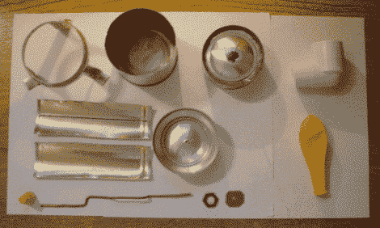

# 铝罐斯特林发动机

> 原文：<https://hackaday.com/2006/01/04/stirling-engine-from-aluminum-cans/>

当你只见过燃气和柴油发动机时，斯特林发动机看起来就像一个古怪的设计。尽管斯特林发动机是基于活塞的，但它不使用阀门。它有一个密封的工作流体，没有废气。斯特林发动机并不常见，但在商业上作为低温冷却器生产，并用于太阳能发电场。这里有一些用铝罐建造[模型斯特林发动机的详细计划。](http://www.physics.sfasu.edu/astro/courses/egr112/StirlingEngine/stirling.html)

[谢谢哈哈]

*   [永久链接](http://www.physics.sfasu.edu/astro/courses/egr112/StirlingEngine/stirling.html)