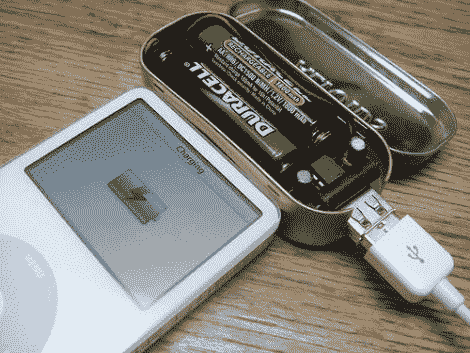

# 薄荷升压，基于 AA 的 USB 充电器

> 原文：<https://hackaday.com/2006/05/31/minty-boost-aa-based-usb-charger/>

Limor a.k.a. [Ladyada](http://www.ladyada.net/) 一直是 Hack-A-Day 社区的常客，我们非常高兴听到她的最新项目。 [Minty Boost](http://www.instructables.com/ex/i/1686FF3E41011029AC23001143E7E506/) 是对构建电池供电 USB 充电器的想法的改进。大多数设计(包括我们的)使用 7805 线性稳压器和 9V 电池。即使在最好的情况下，调节器也只有 60%的效率，这意味着你至少损失了 1/3 的热量。Limor 的设计是一种更有效的升压转换器设计，并使用更常见的(和可充电的)AA 电池。她写了一篇关于如何在 Altoids 口香糖罐中制造转换器的详细文章。最终结果是 82%的效率，可以有效地将视频 iPod 的播放时间增加一倍。

指南并没有到此为止。实际上，Limor 写这篇文章是为了演示如何制作一个可配套的项目。她涵盖了整个过程，从元件选择，到大规模 PCB 生产，到她的最终成本分解。由于一些良好的规划，指南中充满了图片。当然，我们从指南中学到的最有趣的事情是:尽管一直使用罐头，利莫尔发现 Altoids 口香糖的味道令人作呕。

[指南在她的网站上，但我们链接到 Instructables 上的[版本，因为我们过去曾成功关闭她的网站……通过](http://www.instructables.com/ex/i/1686FF3E41011029AC23001143E7E506/)[宣布她的网站重新上线](http://www.hackaday.com/entry/1234000120058314/)。]

*   [永久链接](http://www.instructables.com/ex/i/1686FF3E41011029AC23001143E7E506/)