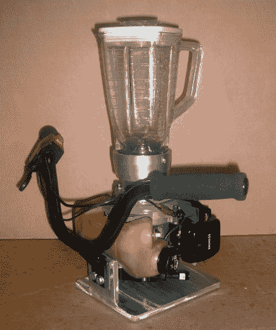

# 气体动力搅拌机

> 原文：<https://hackaday.com/2006/08/14/gas-powered-blender/>

*我今天要参加我最好朋友的父亲的葬礼。作为一名机械工程师，我一直钦佩这位优秀的机械师。以下是我去年写的一篇关于他的气体动力搅拌机的文章。我们会非常想念你的，弗罗斯特先生。*

我的室友 Frosty 经常开玩笑说他爸爸有多少割草机和除草机。看起来他的爸爸已经决定处理这些乱七八糟的东西，而我，作为一个人，很害怕。是的，我的朋友，一个气体动力搅拌机。在之前[已经完成了，但是你必须尊重格雷格的刮刮乐建造能力。最后，你可以在短短几秒钟内蒸发冰，而且手柄杆的安装方式保证让这个搞笑的过程比平时更亲密。根据我的计算，这意味着他在车库里还有四个引擎；我不知道接下来会发生什么，但上帝会帮助我们所有人。](http://www.totallygross.com/)

