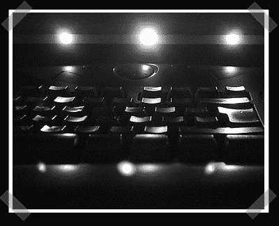

# 更多键盘照明

> 原文：<https://hackaday.com/2006/09/15/more-keyboard-lighting/>

【sfriswolker】发来了他进步的黑色键盘灯光 mod。第一版[用了一个 CCFL](http://linkshideout.blogspot.com/2006/09/black-keyboard-lighting-parte-1.html) 。当它烧毁后，他[用发光二极管](http://linkshideout.blogspot.com/2006/09/black-keyboard-lighting-parte-2.html)重建了它。[谷歌英语交易-[第一部分](http://www.google.com/translate?u=http%3A%2F%2Flinkshideout.blogspot.com%2F2006%2F09%2Fblack-keyboard-lighting-parte-1.html&langpair=es%7Cen&hl=en&ie=UTF8)和[第二部分](http://www.google.com/translate?u=http%3A%2F%2Flinkshideout.blogspot.com%2F2006%2F09%2Fblack-keyboard-lighting-parte-2.html&langpair=es%7Cen&hl=en&ie=UTF8)

*   [永久链接](http://linkshideout.blogspot.com/2006/09/black-keyboard-lighting-parte-1.html)