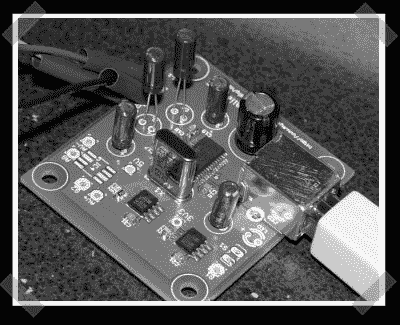

# USB 外来 DAC

> 原文：<https://hackaday.com/2006/10/05/usb-alien-dac/>

[blip]让我们了解一下这个不错的小项目。[外星人 DAC 项目](http://www.myexposition.com/diy/usbdac/overview.html)基本上是 DIY USB 声卡/接口。[图为库克在 head-fi.org建造的一个]它以 TI PCM2702 为核心，配有一些用于功率调节的支持芯片和模拟音频信号的虚拟接地。它很小，应该能完成任务。如果你真的有兴趣让它更上一层楼，看看 [DAC-3](http://www.overclockers.com.au/~mwp/dac3/) 。就像是外星人 DAC 的大哥哥。那东西是架装式的，有光纤、同轴电缆和 USB 输入。如果你遇到更多的浮动广告，请告诉我。他们不应该出现在网站上，我们正在努力保护他们。]

*   [永久链接](http://www.myexposition.com/diy/usbdac/overview.html)