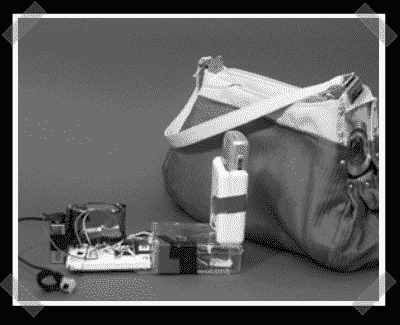

# 黑客日获胜者

> 原文：<https://hackaday.com/2006/10/12/hack-day-winners/>

雅虎最近举办了*咳咳* [黑客日](http://developer.yahoo.net/hackday/)开发者大会/研讨会。获胜者的照片是一个“博客钱包”。看起来它只是上传图像。细节有点薄弱，但有些东西看起来很整洁。[钱包](http://www.blogginginmotion.com/)包含相机、基本邮票、计步器和诺基亚手机。
[YBox](http://uncommonprojects.com/ybox/)是某种网络到电视的网关(微控制器、以太网、IR 接收器、altoids tin 中的 RF 输出)。看起来像是从雅虎频道中提取数据，但应该是可配置的自定义数据。

说到竞赛，[David]指出了这个 [ARM 设计竞赛](http://www.uchobby.com/index.php/2006/10/12/design-contest-for-new-arm-coretex-m3-controllers/)——参赛将获得一个免费的开发套件。