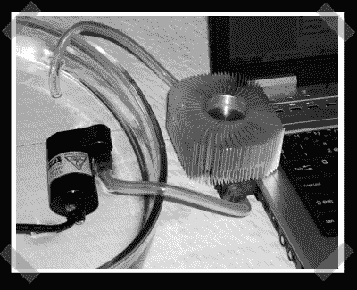

# 可拆卸笔记本电脑水冷

> 原文：<https://hackaday.com/2006/10/13/removable-laptop-water-cooling/>

【吟游诗人】刚给我发了个好看的[水冷 hack](http://folk.ntnu.no/bardlund/hack.jsp) 。他建造了一个简单的水冷却系统，可以手动插入他的笔记本电脑的冷却系统。他想用它来看电影，没有烦人的风扇噪音。他用炉子而不是标准的丙烷火炬将零件焊接在一起。需要绝对是发明之母。我希望他能重新安置水冷系统。当他想移动时，他只需拔掉散热片。

*   [永久链接](http://folk.ntnu.no/bardlund/hack.jsp)