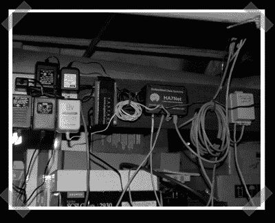

# 环境监测

> 原文：<https://hackaday.com/2006/10/24/environmental-monitoring/>

【Daniel Klien】发给我他的 [thermd 环境监测](http://www.klein.com/thermd/)项目。它是用 perl 编写的，但是最酷的部分是受支持设备的数量。当一个开发人员被给予测试硬件以便他可以添加对它的支持时，这是非常罕见的。

当然，这不是硬件入侵，但温度记录是硬件入侵的恼人问题之一。我对它有很多用途——咖啡烘焙、房屋管理、电池充电、监控我的电动摩托车项目。

*   [永久链接](http://www.klein.com/thermd/)