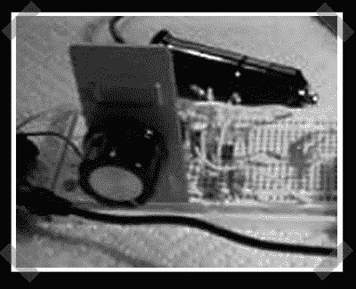

# 氧气传感器模拟器

> 原文：<https://hackaday.com/2006/11/14/o2-sensor-simulator/>

【鲍勃·布利克】用一辆 555 和其他几个普通零件建造了[这个模拟器](http://www.bobblick.com/techref/projects/o2sensor/o2sim/o2sim.html)。正当我以为我已经看到了 555 的所有用途。汽车排气管上的氧传感器用来确定混合燃料对发动机的效率。这些可能是一个真正的痛苦更换，所以它可以帮助伪造的信号到 ECU。

*   [永久链接](http://www.bobblick.com/techref/projects/o2sensor/o2sim/o2sim.html)