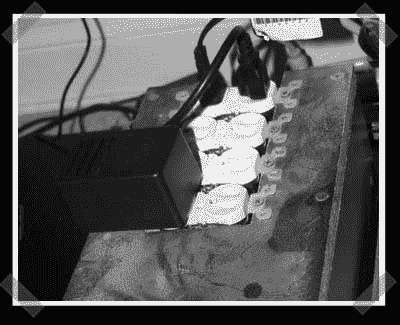

# 屏幕保护程序电源切换

> 原文：<https://hackaday.com/2006/11/19/screen-saver-power-switching/>

这是[沿着](http://www.instructables.com/id/EE62QUOM31EUOJJVA4)[串控电源插座](http://www.hackaday.com/2006/11/04/serial-controlled-power-outlet/)路线的另一个电源控制黑客。[Brent]不仅管理一台打印机，还使用并行端口的 IO 线来驱动一些 SSR，以便关闭他的所有外围设备，比如灯、扬声器、扫描仪等。他把整件事贴在了 instructables 上。

【想炫耀自己的技术？将您的最新建议发送给我们，或者参加[黑客日设计挑战](http://www.hackaday.com/2006/11/15/hackaday-design-challenge-yes-a-contest/)。本周晚些时候，我应该会宣布更多的奖项。我只是在等他们的到来。]

*   [永久链接](http://www.instructables.com/id/EE62QUOM31EUOJJVA4)