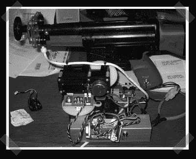

# Defcon 机器人规则宣布

> 原文：<https://hackaday.com/2006/12/02/defcon-bot-rules-announced/>

[Defcon bots 规则已经公布](http://defconbots.org/defcon15/rules.php)为 Defcon 15。实际上，参考设计本身就很不错——我很想知道团队会做出什么样的改进。研发包括一个完整的教程，所以团队肯定会有一个战斗的机会。【via [午夜研究实验室】](http://midnightresearch.com/pages/defconbots-rules-announced/)

唯一的规则是速度，所以我想知道有多少枪会有多个枪管。看起来他们并不在乎用了多少弹药。(它确实说没有散弹枪)Hrm，也许是一个覆盖 5×5 区域的迷你枪，分辨率足够高，可以击中任何东西？当然，它缺乏策略，但火力充足！

现在我找不到他的页面了，但是 Danger 的创始人之一用 Mac 作为控制器和彩弹枪做了类似的东西。当然，[我们在](http://hackaday.com/2005/09/21/robotic-sentry-gun/)之前也见过类似的枪。

*   [永久链接](http://midnightresearch.com/pages/defconbots-rules-announced/)