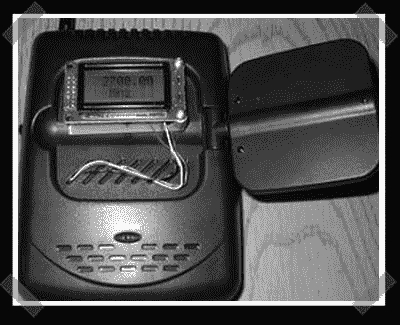

# 无线视频扫描仪

> 原文：<https://hackaday.com/2006/12/06/wireless-video-scanner/>

【abox man】让我注意到了这个漂亮的 [wavecom jr mod](http://www.ringolake.com/pic_proj/wavecom/wavecom_rx.html) 。几年前，当 X10 版本问世时，我第一次遇到了扫描无线视频信号。人们对空中飞行的视频信号数量感到惊讶。这个小项目产生了一个可以扫描 2.3 到 2.7Ghz 宽范围的单元。当然，如果你在对岸，你可能想要一辆欧洲版的。

*   [永久链接](http://www.ringolake.com/pic_proj/wavecom/wavecom_rx.html)