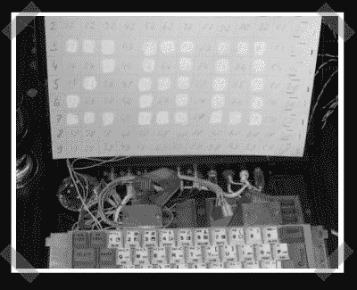

# DIY 俄罗斯 EL 显示器

> 原文：<https://hackaday.com/2006/12/11/diy-russian-el-display/>

嗯，我很确定这是一个手工制作的放射性(如镭)[电致发光显示器](http://www.indiana.edu/%7Ehightech/fpd/papers/ELDs.html)。[的原始帖子是俄语](http://www.sheppard.ru/articles/fe/radiation/index.shtml)，它的[翻译版本](http://silakoff.blogspot.com/2006/12/hand-made-radioactive-monitor.html)读起来不太连贯。看起来他们借了一个路牌，熔化了镭涂料，然后给他们自己的显示屏上漆。最后，他们把它连到了辛克莱 Z80 上。时髦。谢谢[维克托斯]

*   [永久链接](http://silakoff.blogspot.com/2006/12/hand-made-radioactive-monitor.html)