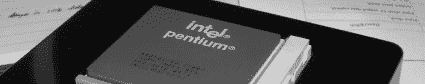

# 奔腾动力外加该死的激光

> 原文：<https://hackaday.com/2006/12/14/pentium-powered-extra-with-friggin-lasers/>

【尼尔】送来[这张](http://forums.kustompcs.co.uk/showthread.php?t=41077)，我觉得这张非常有趣。回收这些旧 CPU 的最新用途:~~用 USB 线给它们充点电，让你的咖啡杯保持温暖。~~将它们用作发热电阻的敷料。

[nik]想出了一个非破坏性的方法在他的 thinkpad 上安装一个外部 wi-fi 天线。我喜欢它，但我认为你需要一个双倍高度的 PCMCIA 插槽来安装它——也许可以为 powerbook/macbook 制造一个更薄的版本。

【混子】发现了一些有趣的 [diy 激光项目](http://spt06.chez-alice.fr/00/lasers.htm)。包括[一个 10 美元的空气激光器](http://spt06.chez-alice.fr/00/air.htm)。太好了。

[joek1010]注意到一些有趣的[网络摄像头激光黑客](http://ashishrd.blogspot.com/index.html)。激光跟踪网络摄像头有明确的可能性。

[dualbandit]发现了一个类似的扭曲，但这次是用激光笔来遥控媒体中心。

如果你一直在关注它，我在 Engadget 上的 DIY 高清投影仪已经完成了最后的审查。我对图像质量很满意，但我可能会稍微调整一下灯/反射镜组件。

哦，如果你喜欢利用自动售货机获取免费可乐，看起来他们已经推出了固件补丁。

请记住，还有 11 天就可以报名参加[设计挑战](http://www.hackaday.com/2006/11/15/hackaday-design-challenge-yes-a-contest/)。如果你需要动力，只需[查看奖品](http://www.hackaday.com/2006/11/29/design-challenge-prize-update-delta/)。