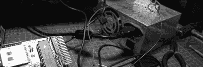

# DIY MP3 操作指南

> 原文：<https://hackaday.com/2006/12/20/diy-mp3-how-to/>

简单提一下——我在[制作自己的 MP3 播放器](http://gadgets.engadget.com/2006/12/19/how-to-make-your-own-mp3-player/)的操作指南到了。这更像是一次构建演练和对 MAKE 的 Daisy MP3 播放器套件的回顾。

如果你错过了，本·赫克会教你如何制作自己的机器人手。这更像是一次 CAD 设计的练习，目的是在数控机床上切割零件。这是本工作流程的绝佳视角。他曾经在某个时候用~~酷刑~~ er 训练图形艺术家，他把这种经验运用到他的设计中。说到这里，你可能会喜欢他的 [SCART 视频切换器](http://benheck.com/)。

我不得不说，我对迄今为止在[设计挑战](http://www.hackaday.com/2006/11/15/hackaday-design-challenge-yes-a-contest/)上所做的努力印象深刻。你还有五天时间让他们进来。

在我忘记之前，我需要一个好的聚四氟乙烯/聚四氟乙烯绝缘线供应商(价格合理)。建议？