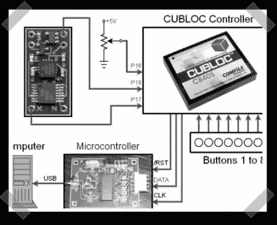

# DIY 'PS3 六轴'控制器

> 原文：<https://hackaday.com/2006/12/22/diy-ps3-sixaxis-controller/>

【max】让我们了解一下这个[DIY‘PS3 六轴’风格的可编程控制器](http://zedomax.com/blog/zedomax-diy121-how-to-make-your-own-ps3-sixaxis-controller/)。这是一种 USB 设备，使用加速度计来提供交互式人机界面。他们把一个放在一架[模型飞机里，用它来模拟飞行。(我希望看到他们增加一些陀螺仪，为飞机接口增加一些现实的阻力。)](http://www.youtube.com/watch?v=gIlhhBVr8Fk)

*   [永久链接](http://zedomax.com/blog/zedomax-diy121-how-to-make-your-own-ps3-sixaxis-controller/)