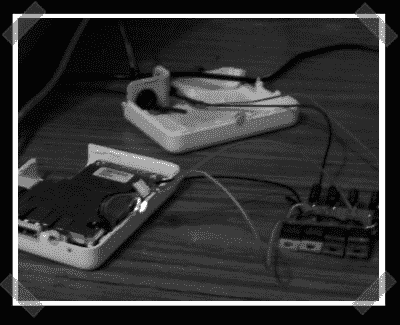

# 机场快修

> 原文：<https://hackaday.com/2006/12/31/airport-express-repair/>

【Eduard】好心的把这个[机场快线 psu 维修指南](http://www.entremaqueros.net/bitacoras/roshardware/archives/reparar-un-airport-express-actualizado/) ( [翻译版](http://translate.google.com/translate?u=http%3A%2F%2Fwww.entremaqueros.net%2Fbitacoras%2Froshardware%2Farchives%2Freparar-un-airport-express-actualizado%2F&langpair=es%7Cen&hl=es&ie=UTF-8&oe=UTF-8&prev=%2Flanguage_tools))。旧机场有那些令人讨厌的电容器问题。很明显小机器人的电源有问题。解决办法？添加一堆电压调节器和一些平滑帽来恢复供电。没有关于新 PSU 如何影响声音输出的消息。

*   [永久链接](http://www.entremaqueros.net/bitacoras/roshardware/archives/reparar-un-airport-express-actualizado/)