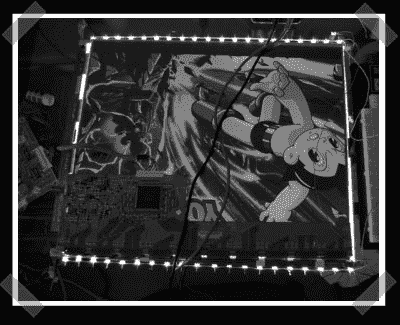

# LED 液晶屏背光更换

> 原文：<https://hackaday.com/2007/01/09/led-lcd-backlight-replacement/>

【Keith】的表哥送给他一台背光嘈杂的液晶显示器。他决定[用一系列高输出发光二极管代替](http://www.engr.mun.ca/~wakeham/lcd.htm)。他从当地一家汽车配件商店购买了一些廉价的 LED 头灯。结果看起来相当不错——文章中有这样一段话:“……一个[LED]也因意外过电压而爆炸。射中了我的胸部。面板没问题，虽然“干得好。

*   [永久链接](http://www.engr.mun.ca/~wakeham/lcd.htm)