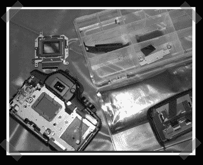

# Digital Rebel XT(350D)红外消除

> 原文：<https://hackaday.com/2007/01/16/digital-rebel-xt350d-ir-removal/>

【ash】对[的这些指示](http://personales.ya.com/javier_laina/ARTICULOS/FILTRO/filtro350deng.html)不满意，所以他提供了一份[完整的操作指南](http://astro.ai-software.com/articles/mod_350D/mod_350D.html)关于去除反叛 XT 的玻璃红外过滤器。这个包括把所有东西都拉到 CCD 上。一旦红外玻璃被移除，它会被埃德蒙光学公司的一些高级玻璃所取代。如果你对相机改装感兴趣，并且拥有一台数码相机，那么指南末尾的参考链接值得一读。

*   [永久链接](http://personales.ya.com/javier_laina/ARTICULOS/FILTRO/filtro350deng.html)