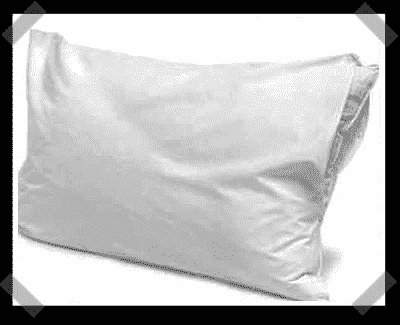

# 互动枕头

> 原文：<https://hackaday.com/2007/01/18/interactive-pillow/>

苏黎世大学的
【Nicolas büchi】派出他的团队[最新项目](http://interaction.hgkz.ch/projects/physcomp/seminare/physical-computing-ws06-3sem/dokumentation/gruppe-3/)。这种无害的枕头根据当前的光线条件和近程传感(压力)与用户进行交互。项目页面是德语的，但是[视频演示](http://interaction.hgkz.ch/projects/physcomp/wp-content/files/kissen_movie_klein.mov)解释了它。我喜欢振动枕头闹钟的想法——只要你晚上不会把它弄丢。这让我想起了[clock](http://alumni.media.mit.edu/~nanda/projects/clocky.html)——其实就是现在待售的。

*   [永久链接](http://interaction.hgkz.ch/projects/physcomp/seminare/physical-computing-ws06-3sem/dokumentation/gruppe-3/)