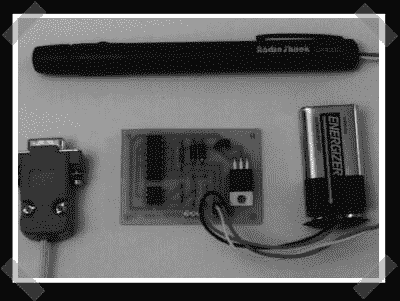

# RS-232 串行激光链路

> 原文：<https://hackaday.com/2007/01/28/rs-232-serial-laser-link/>

【ashish】通过提示行送来[这个](http://www.geocities.com/SiliconValley/Lakes/7156/laser.htm)。(编者注:链接腐烂。[试试这个](http://web.archive.org/web/20070716043916/http://www.geocities.com/SiliconValley/Lakes/7156/laser.htm)。)这是一个创建基于激光的 RS-232 链接的项目。它基于廉价的激光笔、MAX232 和接收信号的光敏电阻。

*   [永久链接](http://www.geocities.com/SiliconValley/Lakes/7156/laser.htm)