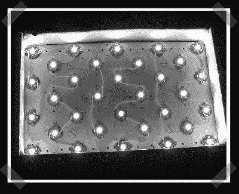

# 水冷 led 背光液晶显示器

> 原文：<https://hackaday.com/2007/01/31/watercooled-led-backlit-lcd/>

【约翰】提到[这个](http://www.mp3car.com/vbulletin/showthread.php?t=43743&page=8)在 [LCD LED 背光柱](http://www.hackaday.com/2007/01/09/led-lcd-backlight-replacement/)上。鉴于帖子上的日期，我很惊讶我们以前没有见过它。他用安装在定制铜水冷块上的 32 个 1 瓦 luxeon LEDs 取代了 CCFL 灯。结果是足够亮的，以至于在他的车里都可以看到阳光。

*   [永久链接](http://www.mp3car.com/vbulletin/showthread.php?t=43743&page=8)