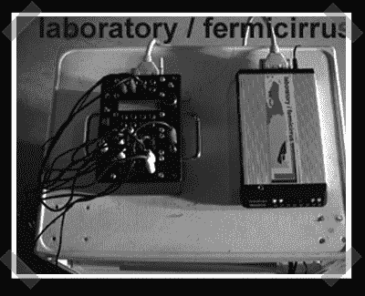

# Bent 2400 波特调制解调器

> 原文：<https://hackaday.com/2007/02/09/bent-2400-baud-modem/>

[这个](http://www.cosmicblooper.com/index.htm)赢得了我对硬件非预期使用的投票。[内森]把他弯曲的调制解调器送进来。他的转接盒接收 midi 信号，并使用它们从一个旧的 Packard Bell 外部调制解调器生成各种调制解调器声音。现在，来点图表怎么样？点击[链接](http://www.cosmicblooper.com/index.htm)观看使用中的视频。

*   [永久链接](http://www.cosmicblooper.com/index.htm)