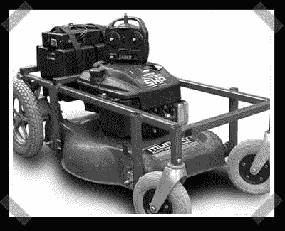

# 遥控割草机

> 原文：<https://hackaday.com/2007/02/11/remote-control-lawn-mower/>

【特里】[发来了他在自己网站上发布的第一个](http://members.iinet.net.au/~tnpshow/RCLM/intro.htm)项目。我在美国中西部长大，我甚至无法表达当我还是个孩子的时候，我是多么渴望造一只这样的小狗。他的遥控割草机本质上是遥控汽车、轮椅和割草机三者之间的私生子。无线电从轮椅上与控制盒接口，否则这是一个很好的焊接项目。

干得好。我有一个建议——一个安全电路，如果失去无线电控制，它会使割草机无法工作。有一些专为遥控项目设计的设备可以达到这个目的。(更新:好吧，设计中有一个故障保险，但我不会称之为可选！)

*   [永久链接](http://members.iinet.net.au/~tnpshow/RCLM/intro.htm)