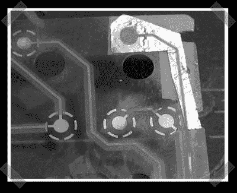

# 键盘触点修复

> 原文：<https://hackaday.com/2007/02/12/keyboard-contact-repair/>

这里有一点来自过去的爆炸，但我敢打赌，我们许多人都遇到过[这个](http://www.applefritter.com/node/19402)问题。键盘触点可能会磨损，被饮料溅出或电视机留下的酸损坏。汽车除霜器修补漆应该有用——如果手头有一些的话。[eeun]记录了一个使用家用铝箔和强力胶的键盘触点修复方法。

*   [永久链接](http://www.applefritter.com/node/19402)