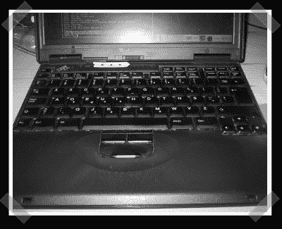

# DIY 德沃夏克键盘

> 原文：<https://hackaday.com/2007/03/01/diy-dvorak-keyboards/>

遇见 [DIY 德沃夏克键盘](http://0x63.nu/)。这周我很怀旧，我很惊讶我们从来没有提到这个简单但有用的方法。异端历史教训:qwerty 键盘的发明是为了降低打字速度——因为老式打字机太容易卡住了。[德沃夏克键盘](http://en.wikipedia.org/wiki/Dvorak_Simplified_Keyboard)效率更高，因为最常用的字母位置更接近手指的自然位置。【安德斯】交换了他的[瑞典 thinkpad](http://0x63.nu/) 上的按键，甚至根据自己的喜好进一步定制了地图。

*   [永久链接](http://0x63.nu/)