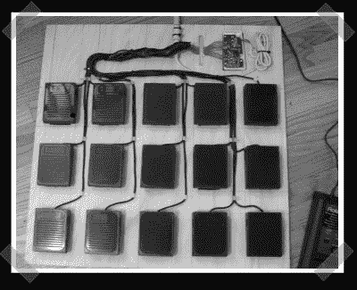

# 迪伊中午踏板

> 原文::1230【https://hacked ay . com/2007/03/06/DIY-midi-foot 踏板/

【福里斯特】把这个 diy [脚踏‘midi’控制器](http://blog.myspace.com/index.cfm?fuseaction=blog.view&friendID=953540&blogID=237382481&MyToken=f46f3fa5-0afd-434e-ae22-9bcec29256f4)传了过去。这是一个很好的硬件重用，但不是一个真正的 midi 控制器。pcb 是从一个旧键盘上拆下来的，踏板是从当地无线电棚屋清理箱的疯狂 60 英里之旅中刮出来的。由于踏板是开关上简单的瞬时开关，所以只需将它们连接到控制器，并使用笔记本电脑通过 usb midi 接口产生信号。用一个[鼓控制器](http://www.edrum.info/)代替键盘 pcb，你就有了一个有趣的独立解决方案。

为了享受额外的拥挤，我设法从我公布的设计挑战参赛名单中去掉了另一个参赛作品。[Jason]送来这个 MEGA32 程序员/开发板。他保持单面，但你需要一个并行端口来使用它。

*   [永久链接](http://blog.myspace.com/index.cfm?fuseaction=blog.view&friendID=953540&blogID=237382481&MyToken=f46f3fa5-0afd-434e-ae22-9bcec29256f4)