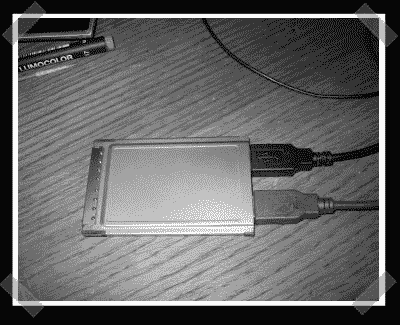

# 缩短的 Usb Pcmcia 卡

> 原文：<https://hackaday.com/2007/03/14/shortened-usb-pcmcia-card/>

【符文】[厌倦了看到自己的 USB 卡挂在笔记本电脑外面的那一面](http://kyndal.dk.googlepages.com/cutpcmciausb2card)。他把它砍下来，重新组装，把所有的内容都保存在他的笔记本电脑里。干得漂亮干净。我以前拆过 PC 卡，拆完之后让它们看起来这么好是一个挑战。

*   [永久链接](http://kyndal.dk.googlepages.com/cutpcmciausb2card)