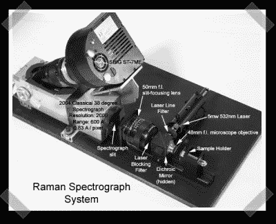

# 建造自己的激光摄谱仪

> 原文：<https://hackaday.com/2007/03/16/build-your-own-laser-spectrograph/>

[新闻](http://edition.cnn.com/2007/EDUCATION/03/14/science.award.ap/)充斥着一个 17 岁的女孩因她的光谱仪赢得了 10 万美元的[奖学金](http://www.sciserv.org/sts/66sts/winners.asp)，但是实际上没有人链接到关于这个东西的信息。经过一番挖掘，我找到了[玛丽]的网站。这是一项正在进行的工作，但我发现了她的摄谱仪构建的早期版本。这张照片展示了她用米德望远镜的摄谱仪头做的项目。希望她能很快拿到光谱仪的资料。这是我见过的 5mw 绿色激光的更好的用途之一。

我忘了提她可爱的多布森望远镜。非常好的工作。

*   [永久链接](http://www.maryspectra.org/)