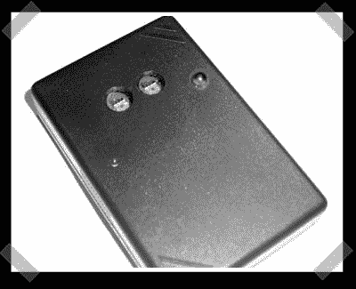

# DIY 色度计

> 原文：<https://hackaday.com/2007/03/19/diy-colorimeter/>

【Brian】向我推荐了这个优秀的[色度计项目](http://www.homecinema-fr.com/colorimetre/sonde.php)用于校准你的家庭影院/高清/等，它是专门为 [HCFR 色度计软件项目](http://www.homecinema-fr.com/colorimetre/index_en.php)设计的。项目页面是英文的，但是调查报告是法文的。鱼会帮助你理解它，同时你会抵制嘲弄，避开飞来的奶牛。该设备至少有一个颜色传感器(第二个是可选的，还有一个或两个红外 led 用于计算机硬件控制)，并通过 USB 连接到您的计算机。大脑是 PIC 18F2550(鱼称之为 PEAK)——不，在电路编程中，你需要一个程序员来构建它。

*   [永久链接](http://www.homecinema-fr.com/colorimetre/sonde.php)