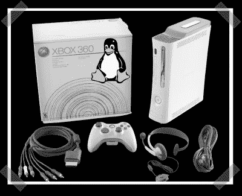

# XBox 360 Linux Bootloader 发布

> 原文：<https://hackaday.com/2007/03/20/xbox-360-linux-bootloader-released/>

【XanTium】让我知道终于有了 [Xbox 360 linux 启动盘](http://www.xbox-scene.com/xbox1data/sep/EEZuFZpZFEucRywmpU.php)。它利用了虚拟机管理程序的漏洞，并且需要一些努力——编译、通过串行电缆执行、加载一些修改后的文件等。它花了足够长的时间，但现在你可以卷自己的，如果你想的话。(我个人只是用了一个 Ubuntu 盒子，带 DVI 和光学音频。)

*   [永久链接](http://www.xbox-scene.com/xbox1data/sep/EEZuFZpZFEucRywmpU.php)