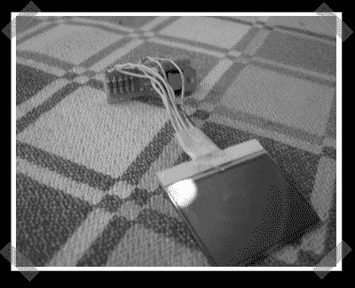

# 笔记本电脑中的诺基亚液晶显示器

> 原文：<https://hackaday.com/2007/03/22/nokia-lcd-in-a-laptop/>

我四处闲逛，偶然发现了[这个](http://forums.bit-tech.net/showthread.php?s=642df2c815ecbfc6e92747748a78e956&t=123757&page=2&pp=20)有趣的 mod 正在进行中。这主要是一项定制旧笔记本电脑的研究，但在掌托中嵌入诺基亚液晶显示器是一个有趣的小技巧。LCD 取自诺基亚 3310，经过改装后连接到并行端口。(大概是用类似[这种](http://forum.lcdinfo.com/viewtopic.php?t=474)的电路)

*   [永久链接](http://forums.bit-tech.net/showthread.php?s=642df2c815ecbfc6e92747748a78e956&t=123757&page=2&pp=20)