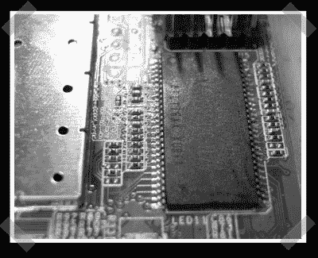

# Fonera Ram 升级

> 原文：<https://hackaday.com/2007/04/09/fonera-ram-upgrade/>

【buggs 187】看到[双天线 lafonera mod](http://www.hackaday.com/2007/03/30/dual-antenna-fonera/) 就想到了[这个](http://www.dd-wrt.com/wiki/index.php/LaFonera_Hardware_32MB_SDRAM_MOD)。[Goldserv]从 ebay 上拿了一个带有正确芯片的 SODIMM，并使用 SMD 拆卸工具更换了 16MB 的 SMD 内存芯片。经过一些软件修补，他设法得到了完整的 32MB 识别。

*   [永久链接](http://www.dd-wrt.com/wiki/index.php/LaFonera_Hardware_32MB_SDRAM_MOD)