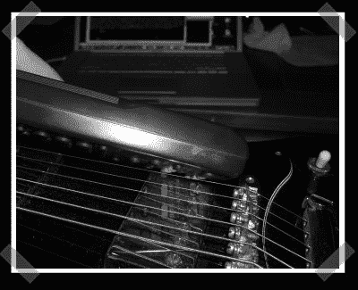

# 用您的…吉他进行红外解码

> 原文：<https://hackaday.com/2007/04/16/ir-decoding-with-your-guitar/>

【Benjamin】发来了[最近见过的最疯狂的事](http://www.datasingularity.com/html/makeshift_ir.html)。他用电吉他中的磁性拾音器来感应红外信号。吉他连接着一个前置放大器，输入他的电脑。通过像 audacity 这样捕捉脉冲，您可以获取代码样本，而无需构建任何专门的硬件。

如果你已经有了一天一次的计划，使用[提示热线](http://hackaday.com/tips)！