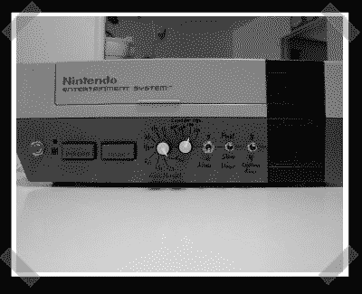

# 从 NES 控制台到专用街机模拟器

> 原文：<https://hackaday.com/2007/04/19/from-nes-console-to-dedicated-arcade-emulator/>

【杰西】[中派来的这个](http://www.raphnet.net/electronique/nes_vs/nes_vs_en.php)一个。[ 拉斐尔决定将 NES 的做法提升到一个新的水平，专门用一台 NES 游戏机全天运行街机版本。这不仅仅是一个 ROM 加载练习，NES 和它的专用街机兄弟之间有几个不同之处，Unisys 对内存进行了升级，几个 io 引脚被挖掘出来，通过新添加的控制进行手动访问。至少，这是一个很好的图式阅读练习。给定 mods 和一些街机配件，你可以重建你自己的全功能街机。

*   [永久链接](http://www.raphnet.net/electronique/nes_vs/nes_vs_en.php?section_id=0)