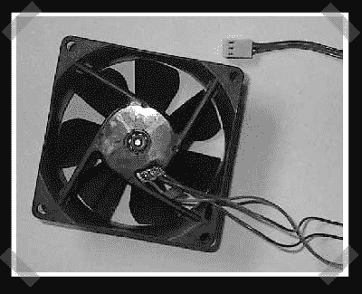

# 访问电脑风扇上的转速传感器

> 原文：<https://hackaday.com/2007/04/26/accessing-the-rpm-sensor-on-a-pc-fan/>

这个[一个](http://www.madshrimps.be/?action=gethowto&howtoID=26)几乎太简单了，但它可能会派上用场。原来 Pabst 风扇(可能还有其他几个)已经有了 RPM 监控电路。拆开它，允许接触 pcb，并将您自己的 RPM 传感器引线添加到 PC 板上。不是所有的风扇都会有它，但它是一个安全的赌注，它会有一个转速传感器，而不是普通 PC 板组件上的转子锁定指示器。

*   [永久链接](http://www.madshrimps.be/?action=gethowto&howtoID=26)