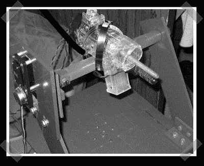

# Defcon 机器人挑战原型

> 原文：<https://hackaday.com/2007/05/01/defcon-bot-challenge-prototype/>

【科林】派出他的[原型](http://www.colinkarpfinger.com/projects/defcon/)参加 [Defcon bot](http://www.hackaday.com/2006/12/02/defcon-bot-rules-announced/) 竞赛。视频中机器人的表现令人印象深刻。休息后继续。他的构建看起来干净简单——他甚至设法以 pololu 伺服控制器的形式赢得了一些赞助。瞄准移动的白色传感器让我想起了致命的热寻机器人的旧麦克盖弗集。

如果你正在开发任何攻击机器人，请随时通过[提示热线](http://hackaday.com/tips)告诉我们。

更新:醒来才发现忘了嵌入视频。现在应该可以了。

<object width="400" height="325"><param value="http://www.youtube.com/v/Sovf6UxKL5E" name="movie"><param value="transparent" name="wmode"></object>

*   [永久链接](http://www.colinkarpfinger.com/projects/defcon)