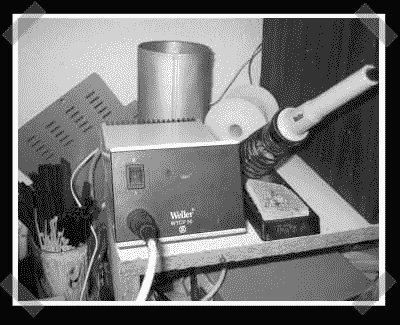

# 烙铁指示器模块

> 原文：<https://hackaday.com/2007/05/17/soldering-iron-indicator-mod/>

乍一看，[sprite_tm]s [韦勒 mod](http://spritesmods.com/?art=wtcpled) 似乎有点猥琐。实际上，这就像是模拟电子技术的艺术。他想为加热元件增加一个指示灯。为了实现这一目标，他构建了一个时髦的二极管电容电路来产生伪调节 DC 电压，然后使用齐纳二极管、电位计和晶体管来制作一个简单的电压开关，激活晶体管驱动的 LED。

*   [永久链接](http://spritesmods.com/?art=wtcpled)