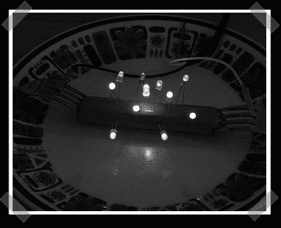

# 七月四日娱乐

> 原文：<https://hackaday.com/2007/07/04/fourth-o-july-entertainment/>

也许你没有疯狂的物理老师，或者错过了【巫师先生】，所以你可能没见过电死煮热狗。这次有了一个新主意——在你的[受害者](http://www.evilmadscientist.com/article.php/hotdogs)体内植入一些发光二极管。谢谢[马修]

如果对你来说这还不够古怪，看看这个由[Jonas]发送的简单 ibook[服务器模型](http://www.c-h-a-o-s.com/2007/07/05/diy-ibook-server-booklet/)。

*   [永久链接](http://www.evilmadscientist.com/article.php/hotdogs)