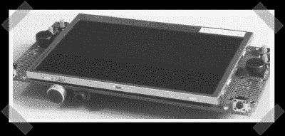

# Virtualcogs 开放式便携式游戏平台

> 原文：<https://hackaday.com/2007/07/12/virtualcogs-open-portable-gaming-platform/>

【大卫】觉得你们可能会喜欢[这个](http://wiki.virtualcogs.com/tiki-view_blog.php?blogId=1)——我同意。这是一个围绕 PSP LCD 构建的开放式游戏平台。它拥有所有的基本功能，并且是可扩展的。他们想订购一批电路板，所以如果你想要的话就告诉他们。如果你很懒，以下是规格:

*   MX21 ARM9 266MHz 处理器，带 64MB SDRAM 和 16 MB 闪存
*   来自 [PSP](http://www.mahalo.com/PSP_Hacks "PSP Hacks - Mahalo") 的 TFT LCD(我们感谢 Sparkfun 的 Nathan 帮助我们解决这个问题)
*   立体声音频编解码器
*   立体声扬声器
*   耳机插孔
*   麦克风
*   几个操纵杆
*   一堆按钮
*   电池组
*   SD/MMC 插槽
*   可扩展(可添加 [GPS](http://www.mahalo.com/GPS "GPS - Mahalo") 、[蓝牙](http://www.mahalo.com/Bluetooth "Bluetooth - Mahalo")、加速度计和陀螺仪等)

大多数硬件相当不错，但电池组可能需要一些帮助。也许一个好的剩余锂离子手机电池。

*   [永久链接](http://wiki.virtualcogs.com/tiki-view_blog.php?blogId=1)