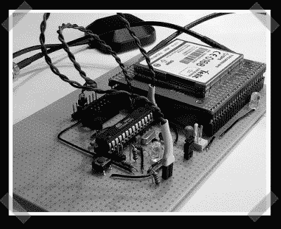

# 使用支持 GPS GSM 的 AVR 进行短信跟踪

> 原文：<https://hackaday.com/2007/07/15/sms-tracking-with-a-gps-gsm-enabled-avr/>

【Alex】发来了他的一些[最新的](http://tinkerlog.com/2007/07/13/interfacing-an-avr-controller-to-a-gps-mobile-phone/)作品。他连接了一些不太便宜的组件，给 AVR GPS 和 GSM I/O。现在，它可以读取 GPS 位置和发送短信。多亏了 GPS/GSM 模块，原理图非常简单——任何具有基本焊接技能并希望在信用卡上留下印记的人都可以制作这个。(AVR 编程可能是最困难的任务)

*   [永久链接](http://tinkerlog.com/2007/07/13/interfacing-an-avr-controller-to-a-gps-mobile-phone/)