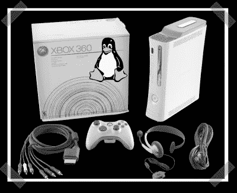

# XBox 360 DVD 地区黑客

> 原文：<https://hackaday.com/2007/07/20/xbox-360-dvd-region-hack/>

【XanTium】几天前发来的，不过我以为你们会喜欢。以下是直接来自他的电子邮件的细节:

XBH 论坛上的黑客设法改变了 Xbox 360“密钥库”中的 DVD 密钥和游戏区域代码(密钥库存储在 flashchip 上:控制台证书、每盒私钥、DVD 密钥，但不包括任何与代码相关的加密密钥)。
然而，你应该知道“密钥库”是用每个 xbox360 的“CPU 密钥”加密的，所以这意味着这种攻击目前只可能在虚拟机管理程序可利用的 Xbox 360(内核 4532 和 4548)上进行。当然，您还必须读取/刷新 Xbox360 闪存芯片(通过脱焊，用编程器读取/刷新，或者使用通用的 Infectus dev 芯片)

你可以在这里阅读更多的细节[或者登录并查看](http://www.xbox-scene.com/xbox1data/sep/EEluZpyZylASxnbxII.php)[实际论坛帖子](http://www.xboxhacker.net/index.php?topic=7872.msg51236#msg51236)。最终结果是:在你的 US 360 上玩欧盟游戏。(听起来不像是成功改变了 DVD 电影区域，但改装的 DVD 播放器很容易制作。)