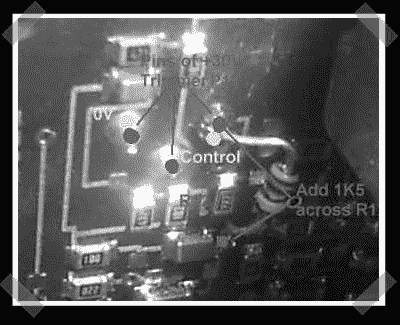

# 开关模式电源黑客(给你的激光器供电)

> 原文：<https://hackaday.com/2007/07/27/switchmode-power-supply-hacking-power-your-laser/>

【Mike】想为他的氩激光器找一个更好的电源，所以他改装了一些开关模式电源。经过一些调整，他有了一些可调节的电压输出，并为他的激光项目提供了可靠的电子供应。如果你的项目需要实验室质量的可调电源，这是一个便宜的好方法。(他在英国，但同样的想法应该适用于美国模特。

*   [永久链接](http://www.electricstuff.co.uk/argonlaser.html)