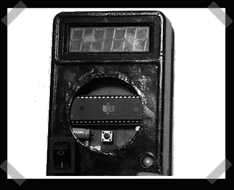

# DIY 频率计

> 原文：<https://hackaday.com/2007/07/29/diy-frequency-meter/>

【狼】前阵子在[这个](http://www.ikalogic.com/projects.php)站点发的，我觉得这个频率计 [how-to](http://www.ikalogic.com/freq_meter.php) 看起来挺有用的。它基于 Atmel AT89C52 和内置万用表。电路还不算太差。(最糟糕的是所有的显示行。)Atmel 获取要测量的信号并驱动显示器，因此器件数量非常少。

*   [永久链接](http://www.ikalogic.com/freq_meter.php)