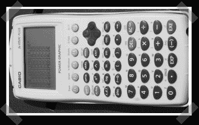

# 卡西欧 Fx-9750G Plus 如何超频

> 原文：<https://hackaday.com/2007/08/01/how-to-overclock-a-casio-fx-9750g-plus/>

【Visceroid】只能在网上找 TI calcs 的超频资源。他花了一些时间在他的卡西欧 fx-9750G plus 的引擎盖下，并为我们写了一篇文章。我快速编辑了一下，但它是这样的:

我打开计算器，显示出带有处理器的主板，RAM、ROM、CPU 和其他一些表面贴装元件都清晰可见。
图形在下面，按钮也在下面的板上。
主电池、备用电池、串口都连接在底层板上，我也能接触到。

带 CPU 的板在上半部分，允许下面板的下半部分显露出来。CPU 是一滴环氧树脂，RAM 是 BSI 的产品。还不知道 ROM 是什么。

CPU 旁边有一个小型表面贴装晶体，3 个引脚，外部两个引脚并联一个电阻。它只是一个小的直角棱镜。中间是地，外面两个是水晶。我把水晶拆下来，用一些细的可弯曲的电线把它拉长。原水晶很难脱手，但它是值得的。

我在电池盒的侧面打了一个洞，就在备用电池的上方。放置黑客开关的最佳地点。我发现了一个 DPDT 开关(实际上有 4 个电极，但只需要 2 个。稍后可能会使用其他一个作为超频指示器)，并将 CPU 的电线焊接到中间，这样你就可以在两个晶体之间切换。

我将原来的晶体连接到开关的一侧，另一侧连接一个新的 8MHz 晶体。我隔离了较大的晶体以防止它短路。较大的晶体是许多微控制器项目中使用的普通双引线晶体之一。我猜共鸣器也是可以接受的。

所以基本上，它是一个 DPDT 开关，在原始晶体和新的更快的晶体之间切换，位于有用的地方。让它可切换是一个好主意，因为这意味着一切都更快，所以你需要切换回正常串行通信。

我认为长电线没有必要屏蔽。虽然需要做一些工作来让一切都很好地适应。我仍然有一点麻烦，它太紧了。一个边缘没有像预期的那样闭合。但至少有用。

一些建议:
备份你的数据并且确保船上没有电源以防万一。

2 倍快
4.3 MHz 到 8 MHz
可能会使用更多的电池电量，虽然
你可能会得到更高的，虽然我不建议这样做。这很可能会使 CPU 变得非常热，或者只是简单地损坏它。也许你可以在上面放个散热器。环氧树脂块也意味着很难散热。

抱歉，如果它有点过于描述！

在未来，我希望做一个 ROM hack 并允许我在原始 ROM 和我自己的 EEPROM 定制系统之间进行选择。不过，这要晚得多。在网上很难找到这种信息。