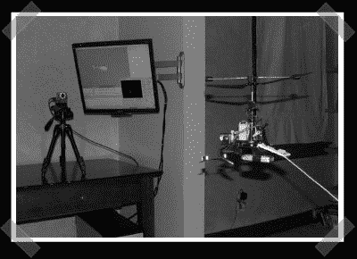

# 红外直升机跟踪

> 原文：<https://hackaday.com/2007/08/15/ir-helicopter-tracking/>

[Lyle]发来了他的一些关于迷你直升机的作品。[这个](http://www.lylechamberlain.com/indoorvision-basedcontrolplatform)钻机是为了测试他的[小型直升机无人机](http://www.lylechamberlain.com/indoorcollisionavoidanceandnavigation)的控制方法而建造的。我希望这里的一些关注会让他为我们记录一些他的家庭测试。(他正在专业地开发一些更大的系统，所以我不确定他是否会。)试验台使用红外摄像机每秒测量 120 次俯仰、偏航和三维定位。

*   [永久链接](http://www.lylechamberlain.com/indoorvision-basedcontrolplatform)