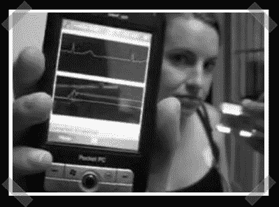

# 普及健康监测(得到奶奶？)

> 原文：<https://hackaday.com/2007/08/22/pervasive-health-monitor-got-granny/>

[Reza]提交了一个他显然投入了大量工作的项目。他的普及健康监测器基本上是一个蓝牙健康遥测记录器/发射器。我认为这绝对是一件优秀的作品。如果我们有足够的兴趣，他会提供更多的技术细节——我同意。

视频(休息后)开始有点枯燥，但相信我——它值得一试。该显示器配有 TI MCU、蓝牙芯片组、闪光灯插座、多个信号放大器和板载音频放大器。PocketPC 正在显示通过蓝牙传输的实时数据流。

<object width="400" height="325"><param name="movie" value="http://www.youtube.com/v/FD3vKNbLv68"><param name="wmode" value="transparent"></object>

*   [永久链接](http://reza.net/cms/index.php?page=HealthMonitor)